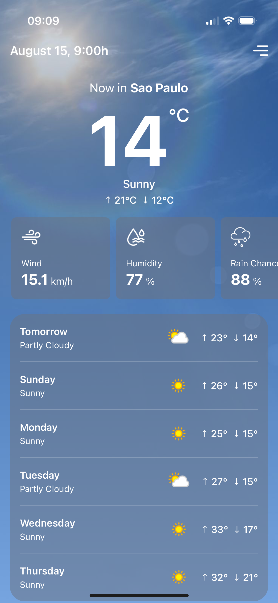
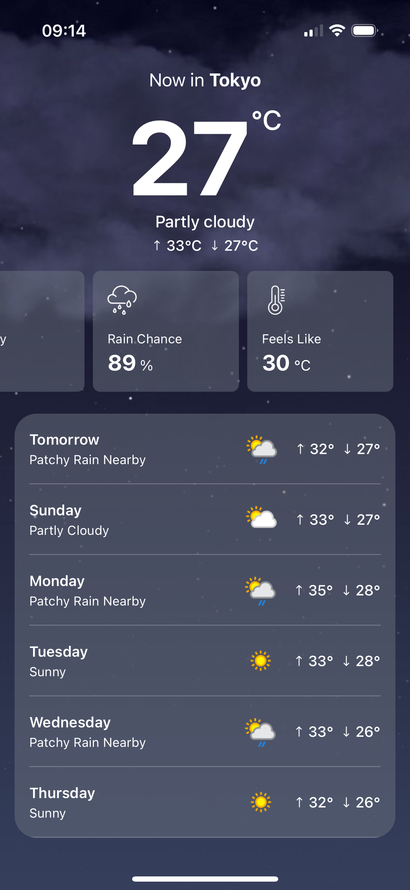
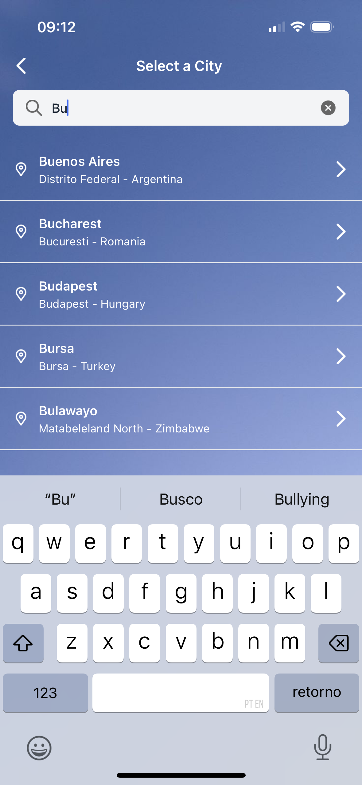
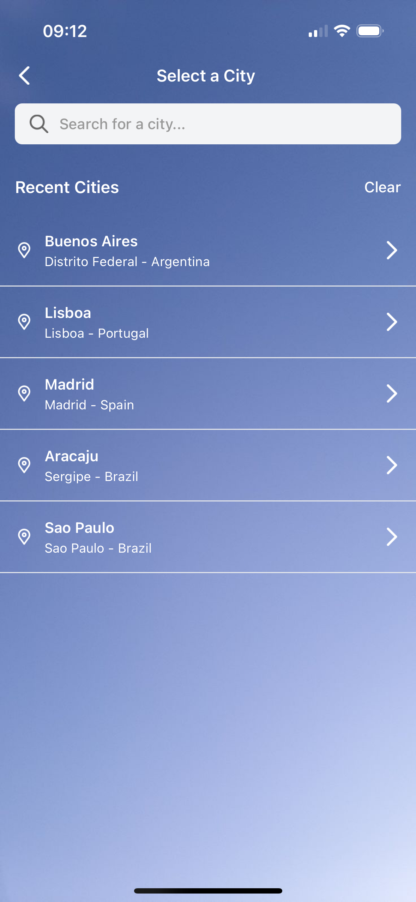
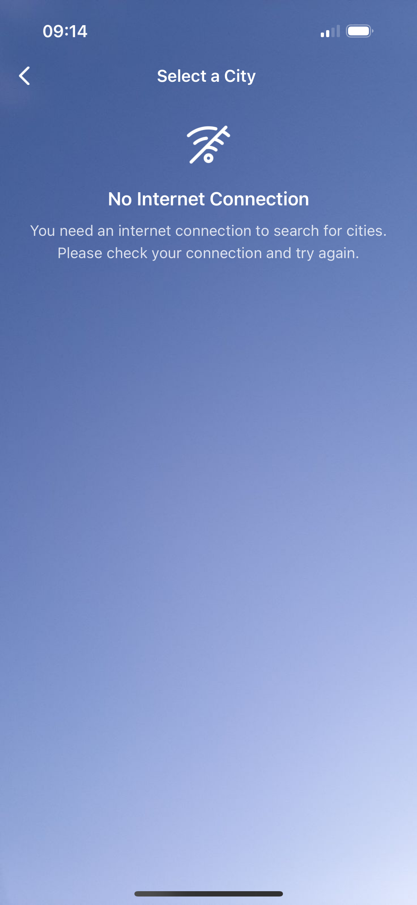

# WeatherApp

> Aplicativo React Native para consulta de previsão do tempo com busca inteligente de cidades

## 📱 Sobre o Projeto

O WeatherApp é um aplicativo mobile desenvolvido em React Native que permite aos usuários consultar a previsão do tempo de qualquer cidade do mundo. O app oferece busca inteligente com sugestões em tempo real, informações detalhadas do clima atual e previsão estendida para os próximos 6 dias.

## ✨ Funcionalidades

- 🔍 Busca inteligente de cidades com sugestões automáticas
- 🌡️ Exibição da temperatura atual em tempo real
- 🌤️ Condições climáticas detalhadas (ensolarado, nublado, chuva, etc.)
- ⏰ Data e hora da última atualização dos dados
- 📅 Previsão do tempo para os próximos 6 dias
- 💾 Armazenamento local das cidadas pesquidas
- 🌐 Verificação de conectividade de rede

## 🛠️ Tecnologias Utilizadas

- [React Native](https://reactnative.dev/) - 0.81.0
- [TypeScript](https://www.typescriptlang.org/)
- [React Navigation](https://reactnavigation.org/)
- [Axios](https://axios-http.com/)
- [Async Storage](https://react-native-async-storage.github.io/async-storage/)
- [NativeWind](https://www.nativewind.dev/)
- [Moment.js](https://momentjs.com/)
- [NetInfo](https://github.com/react-native-netinfo/react-native-netinfo)

## 🌐 API Utilizada

O aplicativo utiliza a [WeatherAPI](https://www.weatherapi.com/) para obter dados meteorológicos:
- **Endpoint de Busca**: Para sugestões de cidades em tempo real
- **Endpoint de Clima Atual**: Para dados meteorológicos atuais
- **Endpoint de Previsão**: Para previsão de 5 dias

## 📋 Pré-requisitos

Antes de começar, certifique-se de ter as seguintes ferramentas instaladas:

- [Node.js](https://nodejs.org/) (versão 18 ou superior)
- [npm](https://www.npmjs.com/) ou [Yarn](https://yarnpkg.com/)
- [React Native CLI](https://reactnative.dev/docs/environment-setup)
- [Android Studio](https://developer.android.com/studio) (para Android)
- [Xcode](https://developer.apple.com/xcode/) e [CocoaPods](https://cocoapods.org/) (para iOS - apenas macOS)
- [Ruby](https://www.ruby-lang.org/) e [Bundler](https://bundler.io/) (para gerenciamento do CocoaPods)

## 🚀 Como executar o projeto

### Clonando o repositório

```bash
git clone https://github.com/marcelojjunior/weather-app.git
cd weather-app
```

### Instalando as dependências

```bash
# Usando npm
npm install

# OU usando Yarn
yarn
```

### Configuração para iOS (apenas macOS)

Na primeira vez que clonar o projeto, instale o Ruby bundler:

```bash
bundle install
```

Em seguida, instale as dependências do CocoaPods:

```bash
bundle exec pod install
```

> **Nota**: Execute `bundle exec pod install` sempre que atualizar dependências nativas.

### Configuração da API

1. Registre-se na [WeatherAPI](https://www.weatherapi.com/) para obter uma chave gratuita
2. Adicionar sua chave no arquivo src/services/api.ts, substituindo YOUR_KEY pelo valor da sua chave::

```env
const api = axios.create({
  baseURL: "https://api.weatherapi.com/v1/",
  timeout: 5000,
  params: {
    key: YOUR_KEY,
  },
});
```

### Executando o projeto

```bash
# Iniciar o Metro Server
npm start
# ou
yarn start

# Para Android (em outro terminal)
npm run android
# ou
yarn android

# Para iOS (apenas macOS, em outro terminal)
npm run ios
# ou
yarn ios
```

## 📱 Screenshots

| Clima Atual | Previsão 5 Dias | Busca de Cidade | Recentes | Sem Internet |
|-------------|------------------|----------------|----------|--------------|
|  |  |  |  |  |

## 👥 Autor

- **Marcelo Junior** - [marcelojjunior](https://github.com/marcelojjunior)

## 📞 Contato

- Email: marcelovfjjunior@gmail.com
- LinkedIn: [Marcelo Junior](https://www.linkedin.com/in/marcelojjunior/)